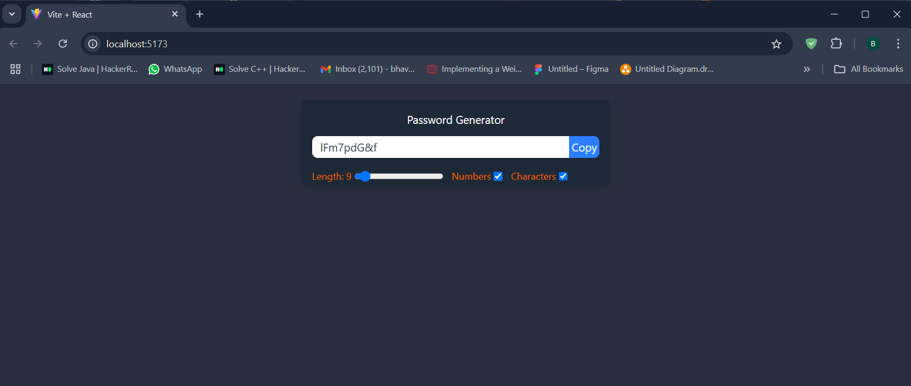

# Password Generator 
### A simple yet powerful Password Generator built with React.js that allows users to create secure passwords dynamically with customizable options.

## Features

* Adjust password length dynamically (6-50 characters).

* Toggle to include numbers and special characters.

* One-click copy-to-clipboard functionality.

* Optimized rendering and performance using React Hooks.

## Tech Stack

* Frontend: Vite + React.js, Tailwind CSS

### React Hooks Used:

* useCallback – Optimized functions for better performance.

* useEffect – Dynamically updated the password based on user preferences.

* useRef – Enabled smooth copy-to-clipboard functionality.

## Demo


## Installation & Setup

### Clone the repository
```
git clone https://github.com/yourusername/password-generator.git
cd password-generator
```
### Install dependencies
```
npm install
```
### Run the development server
```
npm run dev
```
### Open http://localhost:5173 in your browser to see the app.